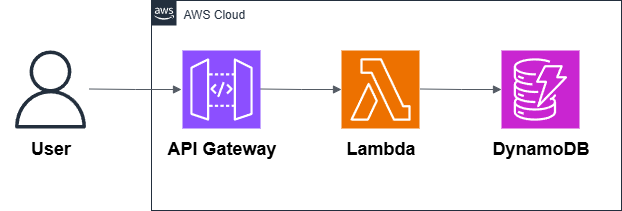
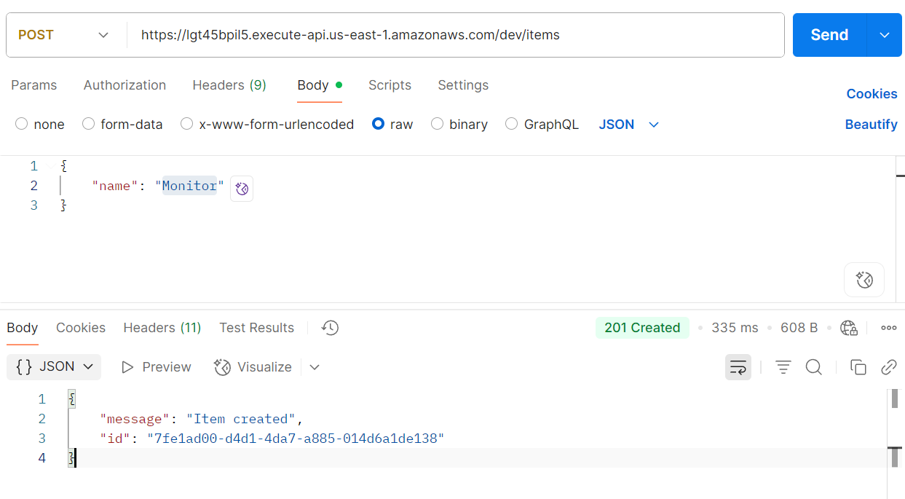
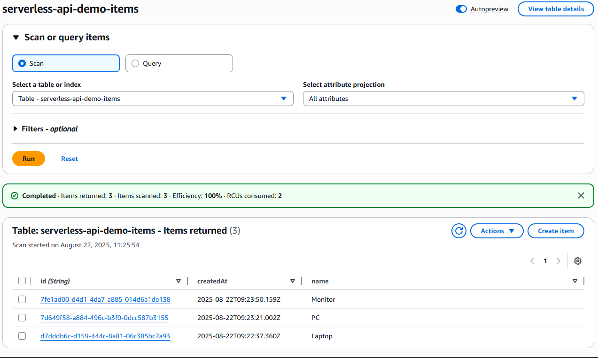
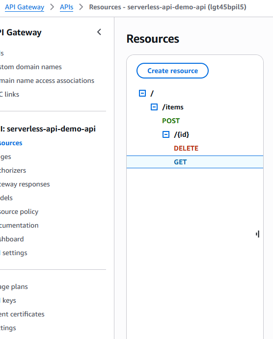

## 🧭 Repository Context

This repository is part of a modularization effort to separate each of the **8 most common AWS architectures** into independent projects.  
The code and resources here were **extracted from a general repository** that originally contained all 8 architectures, to improve clarity, maintainability, and reuse.

🔗 [Original Repository – AWS Architectures Collection](https://github.com/hongzz0618/aws-architecture-collection)

---

## 🔗 AWS Serverless API Backend

This project shows how to build a **serverless API** on AWS.  
It uses **API Gateway**, **AWS Lambda**, and **Amazon DynamoDB** to create a fully managed backend — no servers to maintain.

---

## 📐 Architecture

- **API Gateway** → HTTPS entry point for client requests.
- **Lambda (Node.js)** → Serverless functions that handle the logic.
- **DynamoDB** → NoSQL database to store and retrieve data.

---

## ✅ Why This Pattern?

| Feature           | Benefit                                      |
|------------------|----------------------------------------------|
| **Serverless**    | No infrastructure to manage                 |
| **Scalable**      | Automatically adjusts to traffic            |
| **Cost-efficient**| Pay only for what you use                   |
| **Fast to deploy**| Great for MVPs, prototypes, and production APIs |

---

## 🌍 Real-World Use Cases
- Backend for mobile or web apps
- Lightweight REST APIs
- CRUD operations with DynamoDB
- Microservices with minimal overhead
---

## 📦 What’s Inside
- Architecture diagram
- Terraform code for API Gateway, Lambda, and DynamoDB
- Example Lambda function (Node.js)
- Deployment scripts

---

## Demo Screenshots

Here are a couple of screenshots showing the deployed backend:

  

