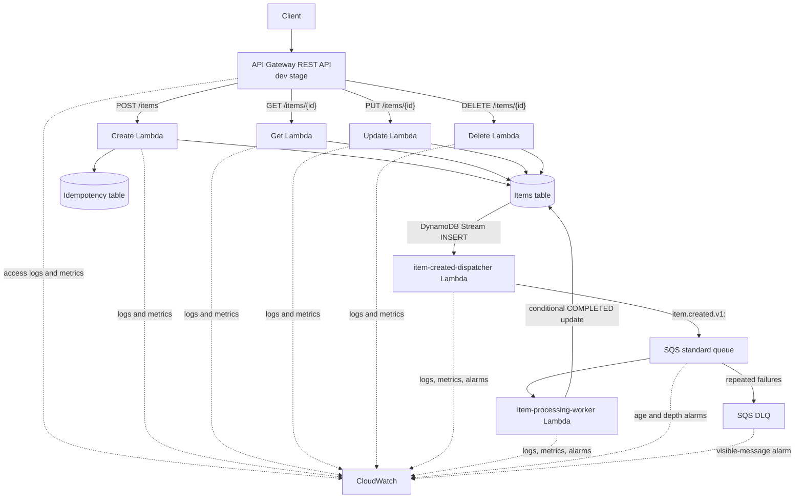
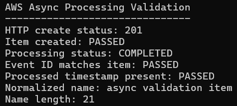
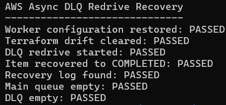

# AWS Serverless API Backend

[](https://github.com/hongzz0618/aws-serverless-api-backend/actions/workflows/ci.yml)

A TypeScript serverless API on AWS using API Gateway, six Lambda functions, DynamoDB, DynamoDB Streams, SQS, a DLQ, CloudWatch, Terraform, and GitHub Actions.

The public API remains a CRUD interface for items. Item creation is durable before asynchronous post-create processing runs through the Stream, Dispatcher, queue, and Worker path.

## Highlights

- CRUD API for create, read, update, and delete
- Idempotency keys for retry-safe item creation
- Optimistic locking for concurrent updates
- Event-driven post-create processing
- Deterministic event IDs for item-created work
- Idempotent Worker conditional updates
- Partial batch failure reporting
- SQS retry and DLQ redrive
- Structured logs and CloudWatch alarms
- Terraform-managed infrastructure and reproducible Lambda packages

## Architecture


```mermaid
flowchart TB
    Client[Client] --> APIGW["API Gateway REST API<br/>dev stage"]

    APIGW -->|"POST /items"| Create["Create Lambda"]
    APIGW -->|"GET /items/{id}"| Get["Get Lambda"]
    APIGW -->|"PUT /items/{id}"| Update["Update Lambda"]
    APIGW -->|"DELETE /items/{id}"| Delete["Delete Lambda"]

    Create --> Items[("Items table")]
    Create --> Idempotency[("Idempotency table")]
    Get --> Items
    Update --> Items
    Delete --> Items

    Items -->|"DynamoDB Stream INSERT"| Dispatcher["item-created-dispatcher Lambda"]
    Dispatcher -->|"item.created.v1:<itemId>"| Queue["SQS standard queue"]
    Queue --> Worker["item-processing-worker Lambda"]
    Worker -->|"conditional COMPLETED update"| Items
    Queue -->|"repeated failures"| DLQ["SQS DLQ"]

    APIGW -. "access logs and metrics" .-> CloudWatch[CloudWatch]
    Create -. "logs and metrics" .-> CloudWatch
    Get -. "logs and metrics" .-> CloudWatch
    Update -. "logs and metrics" .-> CloudWatch
    Delete -. "logs and metrics" .-> CloudWatch
    Dispatcher -. "logs, metrics, alarms" .-> CloudWatch
    Worker -. "logs, metrics, alarms" .-> CloudWatch
    Queue -. "age and depth alarms" .-> CloudWatch
    DLQ -. "visible-message alarm" .-> CloudWatch
```

Terraform provisions the AWS resources and permissions. GitHub Actions validates, tests, and packages the project but does not deploy it.

## API

| Method | Route | Behavior |
| --- | --- | --- |
| `POST` | `/items` | Creates an item using a required `Idempotency-Key` |
| `GET` | `/items/{id}` | Retrieves an item by UUID |
| `PUT` | `/items/{id}` | Updates an item using version-based optimistic locking |
| `DELETE` | `/items/{id}` | Deletes an item by UUID |

Terraform creates a `dev` API Gateway stage.

The complete contract is defined in [`openapi/openapi.yaml`](openapi/openapi.yaml).

## Key Behaviors

### Idempotent creation

`POST /items` requires a client-generated `Idempotency-Key`.

- A new key creates an item and returns `201 Created`.
- Replaying the same key and normalized payload returns the original response.
- Reusing the key with another payload returns `409 Conflict`.
- An active reservation also returns `409 Conflict`.
- Expired in-progress reservations can be recovered by the same key and payload.

The create flow combines an idempotency reservation with a DynamoDB transaction that conditionally creates the item and marks the reservation as completed.

### Optimistic locking

Each item contains an integer `version`.

`PUT /items/{id}` requires the caller to send the expected current version.

- A matching version updates the item and increments the version.
- A stale version returns `409 Conflict`.
- A missing item returns `404 Not Found`.

### Async item processing

Create returns after the durable item write. The stored item initially has `processingStatus = PENDING`.

The async path later changes the item to `processingStatus = COMPLETED`. The Worker uses the deterministic event ID `item.created.v1:<itemId>` and a conditional update so duplicate delivery is expected and safely ignored.

Worker processing updates internal processing fields such as `processedEventId`, `processedAt`, and `creationMetadata`. It does not increment the public API `version`.

### Validation and errors

Zod validates request bodies, UUID path parameters, and stored DynamoDB records.

Invalid requests return consistent JSON errors. Internal failures return safe `500` responses without exposing table names, request fingerprints, AWS request IDs, or stack traces.

## Contract and CI

OpenAPI is used for documentation and automated contract validation. Terraform remains the deployment source for API Gateway.

Contract checks cover:

- OpenAPI syntax and required structure
- Unique operation IDs
- OpenAPI routes against Terraform
- Idempotency-key rules and replay headers
- Update-version requirements
- Representative Lambda responses against response schemas

Run the application checks from `lambdas/`:

```bash
npm ci
npm run typecheck
npm test
npm run contract:validate
npm run test:contract
npm run build
npm audit --omit=dev
```

Package and verify the Lambda artifacts:

```bash
cd ..
bash scripts/package-lambdas.sh

cd lambdas
npm run artifacts:verify
```

The verifier checks ZIP safety, handler exports, production dependencies, Node.js runtime configuration, Terraform wiring, and source hashes.

Run the infrastructure checks from `terraform/` after the Lambda ZIPs have been packaged:

```bash
terraform fmt -check -recursive
terraform init -backend=false -input=false
terraform validate -no-color
terraform test -no-color
```

The native Terraform tests exercise planned DynamoDB, Lambda, API Gateway, invocation-permission, SQS, event-source mapping, CloudWatch, and IAM contracts without creating AWS resources.

GitHub Actions runs the same application, artifact, and Terraform checks with read-only repository permissions and no AWS credentials.

## Deployment

### Prerequisites

- AWS credentials
- Terraform `>= 1.11.0`
- Node.js 22 and npm
- Bash-compatible shell
- `zip` available on `PATH`

### Apply

Run the application, packaging, artifact, and infrastructure checks first, then:

```bash
cd terraform

cp terraform.tfvars.example terraform.tfvars
# Edit terraform.tfvars with local values.

terraform fmt -check -recursive
terraform init
terraform validate -no-color
terraform test -no-color
terraform plan
terraform apply
```

Retrieve the API URL:

```bash
terraform output -raw api_url
```

### Smoke test

The optional smoke test covers creation, replay, idempotency conflict, retrieval, update, stale-version conflict, deletion, and not-found behavior.

```bash
API_URL="$(terraform output -raw api_url)"

cd ../lambdas
API_URL="$API_URL" npm run smoke:test
```

The smoke test requires a deployed API and is not part of the default CI workflow.

For logs, alarms, troubleshooting, and teardown guidance, see the [`operations runbook`](docs/operations.md).

## Observability and Security

Terraform configures:

- Lambda log groups for the CRUD, Dispatcher, and Worker functions
- API Gateway access logs, metrics, and throttling
- Queue age monitoring
- DLQ visible-message monitoring
- DynamoDB Stream `IteratorAge` monitoring
- Application-level dispatch and processing failure metrics
- Lambda `Errors` and `Throttles` alarms
- API Gateway 4XX, 5XX, and latency alarms
- Idempotency replay, conflict, and failure metric filters
- Optional CloudWatch alarm actions

Lambda handlers emit structured JSON logs without recording full request bodies, full idempotency keys, request fingerprints, or sensitive headers.

API Gateway invoke permissions are route-scoped. Lambda permissions are scoped to project resources where AWS supports resource-level permissions; DynamoDB `ListStreams` uses wildcard scope as required by the service.

GitHub Actions uses a read-only repository token and does not receive AWS credentials.

The API does not implement authentication, authorization, CORS, WAF protection, tracing, or per-client quotas.

## AWS Deployment Validation

Two real AWS validation cycles were completed in `eu-west-1`:

- Synchronous baseline: commit `c904ea2`, `58` Terraform-managed resources, evidence `01`-`05`
- Async extension: commit `30f14d4`, final `87` Terraform-managed resources, evidence `06`-`12`

Both validation environments were destroyed after verification.

Full evidence, validation notes, and the partial Apply recovery record are in [`docs/deployment-validation.md`](docs/deployment-validation.md).





## Limitations and Trade-offs

- Async processing is eventually consistent after `POST /items`.
- SQS Standard Queue provides at-least-once delivery, so Worker idempotency is required.
- The DynamoDB Stream mapping has no finite retry count and no stream on-failure destination.
- Terraform uses local state unless another backend is configured.
- Terraform manages the regional API Gateway CloudWatch role; review this account-level setting before using the configuration in a shared AWS account or region.
- The repository does not include authentication, CORS, WAF, tracing, or a multi-environment layout.
- The four CRUD Lambda functions currently share one resource-scoped execution role rather than using a separate role per function.
- CI validates, tests, and packages the project but does not deploy it.
- Alarm notifications require configured `alarm_actions`.

## Architecture Decisions

<details>
<summary>View architecture decision records</summary>

- [001. Use API Gateway, Lambda, and DynamoDB](docs/adr/001-use-serverless-api-gateway-lambda-dynamodb.md)
- [002. Use DynamoDB for item storage](docs/adr/002-use-dynamodb-for-item-storage.md)
- [003. Add validation, structured logs, and observability](docs/adr/003-operability-validation-and-observability.md)
- [004. Evaluate authentication and access-control options](docs/adr/004-authentication-and-access-control-options.md)
- [005. Use conditional writes for item creation](docs/adr/005-use-conditional-writes-for-item-creation.md)
- [006. Use optimistic locking for item updates](docs/adr/006-use-optimistic-locking-for-item-updates.md)
- [007. Use idempotency keys for item creation](docs/adr/007-use-idempotency-keys-for-item-creation.md)
- [008. Use DynamoDB Streams and SQS for item processing](docs/adr/008-use-dynamodb-streams-and-sqs-for-item-processing.md)

</details>

## Cleanup

```bash
cd terraform
terraform destroy
```

Review the destroy plan before confirming. After teardown, verify that no manually created or externally managed resources remain.
