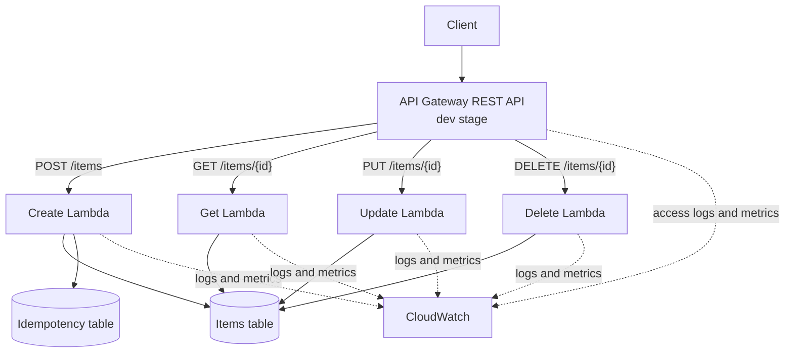

# AWS Serverless API Backend

A TypeScript REST API on AWS using API Gateway, four Lambda functions, DynamoDB, Terraform, and GitHub Actions.

The project focuses on retry-safe writes, optimistic concurrency control, API contract validation, observability, scoped permissions, reproducible Lambda deployment artifacts, and plan-level infrastructure checks.

## Highlights

- Four TypeScript Lambda handlers for create, read, update, and delete
- Idempotency keys for retry-safe item creation
- Optimistic locking for concurrent updates
- Zod validation and consistent JSON error responses
- OpenAPI checks against Terraform routes and Lambda responses
- Structured logs, metrics, alarms, and API Gateway access logs
- Terraform-managed infrastructure and verified Lambda ZIP artifacts
- Native Terraform plan tests for core infrastructure contracts

## Architecture


```mermaid
flowchart TB
    Client[Client] --> APIGW["API Gateway REST API<br/>dev stage"]

    APIGW -->|"POST /items"| Create["Create Lambda"]
    APIGW -->|"GET /items/{id}"| Get["Get Lambda"]
    APIGW -->|"PUT /items/{id}"| Update["Update Lambda"]
    APIGW -->|"DELETE /items/{id}"| Delete["Delete Lambda"]

    Create --> Items[("Items table")]
    Create --> Idempotency[("Idempotency table")]
    Get --> Items
    Update --> Items
    Delete --> Items

    APIGW -. "access logs and metrics" .-> CloudWatch[CloudWatch]
    Create -. "logs and metrics" .-> CloudWatch
    Get -. "logs and metrics" .-> CloudWatch
    Update -. "logs and metrics" .-> CloudWatch
    Delete -. "logs and metrics" .-> CloudWatch
```

The Create Lambda uses both DynamoDB tables to coordinate item creation and response replay. The other handlers access the items table only.

Terraform provisions the AWS resources and permissions. GitHub Actions validates, tests, and packages the project but does not deploy it.

## API

| Method | Route | Behavior |
| --- | --- | --- |
| `POST` | `/items` | Creates an item using a required `Idempotency-Key` |
| `GET` | `/items/{id}` | Retrieves an item by UUID |
| `PUT` | `/items/{id}` | Updates an item using version-based optimistic locking |
| `DELETE` | `/items/{id}` | Deletes an item by UUID |

Terraform creates a `dev` API Gateway stage.

The complete contract is defined in [`openapi/openapi.yaml`](openapi/openapi.yaml).

## Key Behaviors

### Idempotent creation

`POST /items` requires a client-generated `Idempotency-Key`.

- A new key creates an item and returns `201 Created`.
- Replaying the same key and normalized payload returns the original response.
- Reusing the key with another payload returns `409 Conflict`.
- An active reservation also returns `409 Conflict`.
- Expired in-progress reservations can be recovered by the same key and payload.

The create flow combines an idempotency reservation with a DynamoDB transaction that conditionally creates the item and marks the reservation as completed.

### Optimistic locking

Each item contains an integer `version`.

`PUT /items/{id}` requires the caller to send the expected current version.

- A matching version updates the item and increments the version.
- A stale version returns `409 Conflict`.
- A missing item returns `404 Not Found`.

### Validation and errors

Zod validates request bodies, UUID path parameters, and stored DynamoDB records.

Invalid requests return consistent JSON errors. Internal failures return safe `500` responses without exposing table names, request fingerprints, AWS request IDs, or stack traces.

## Contract and CI

OpenAPI is used for documentation and automated contract validation. Terraform remains the deployment source for API Gateway.

Contract checks cover:

- OpenAPI syntax and required structure
- Unique operation IDs
- OpenAPI routes against Terraform
- Idempotency-key rules and replay headers
- Update-version requirements
- Representative Lambda responses against response schemas

Run the application checks from `lambdas/`:

```bash
npm ci
npm run typecheck
npm test
npm run contract:validate
npm run test:contract
npm run build
npm audit --omit=dev
```

Package and verify the Lambda artifacts:

```bash
cd ..
bash scripts/package-lambdas.sh

cd lambdas
npm run artifacts:verify
```

The verifier checks ZIP safety, handler exports, production dependencies, Node.js runtime configuration, Terraform wiring, and source hashes.

Run the infrastructure checks from `terraform/` after the Lambda ZIPs have been packaged:

```bash
terraform fmt -check -recursive
terraform init -backend=false -input=false
terraform validate -no-color
terraform test -no-color
```

The native Terraform tests exercise planned DynamoDB, Lambda, API Gateway, invocation-permission, and IAM contracts without creating AWS resources.

GitHub Actions runs the same application, artifact, and Terraform checks with read-only repository permissions and no AWS credentials.

## Deployment

### Prerequisites

- AWS credentials
- Terraform `>= 1.11.0`
- Node.js 22 and npm
- Bash-compatible shell
- `zip` available on `PATH`

### Apply

Run the application, packaging, artifact, and infrastructure checks first, then:

```bash
cd terraform

cp terraform.tfvars.example terraform.tfvars
# Edit terraform.tfvars with local values.

terraform fmt -check -recursive
terraform init
terraform validate -no-color
terraform test -no-color
terraform plan
terraform apply
```

Retrieve the API URL:

```bash
terraform output -raw api_url
```

### Smoke test

The optional smoke test covers creation, replay, idempotency conflict, retrieval, update, stale-version conflict, deletion, and not-found behavior.

```bash
API_URL="$(terraform output -raw api_url)"

cd ../lambdas
API_URL="$API_URL" npm run smoke:test
```

The smoke test requires a deployed API and is not part of the default CI workflow.

For logs, alarms, troubleshooting, and teardown guidance, see the [`operations runbook`](docs/operations.md).

## Observability and Security

Terraform configures:

- Lambda log groups with configurable retention
- API Gateway access logs, metrics, and throttling
- Lambda error, handled-500, and throttle alarms
- API Gateway 4XX, 5XX, and latency alarms
- Item-table DynamoDB system-error monitoring
- Idempotency replay, conflict, and failure metric filters
- Optional CloudWatch alarm actions

Lambda handlers emit structured JSON logs without recording full request bodies, full idempotency keys, request fingerprints, or sensitive headers.

API Gateway invocation permissions are scoped to the implemented routes. Lambda permissions are resource-scoped to the project DynamoDB tables and CloudWatch log groups.

GitHub Actions uses a read-only repository token and does not receive AWS credentials.

The API does not implement authentication, authorization, CORS, WAF protection, or per-client quotas. It should not be exposed for broader use without an identity and abuse-protection strategy.

## AWS Deployment Validation

A complete deployment, runtime-validation, and teardown cycle was executed in `eu-west-1` using real AWS resources. The cycle covered deployment of 58 Terraform-managed resources, runtime smoke testing, API Gateway access-log review, Lambda structured-log review, CloudWatch alarm verification, cleanup, and post-destroy reproducibility checks.

The runtime checks covered item creation, idempotent replay, idempotency-key conflict handling, item retrieval, optimistic-locking update, stale-version conflict handling, deletion, and post-deletion `404` behavior. During validation, an IAM defect in the Lambda DynamoDB policy was found, corrected, covered by regression tests, redeployed, and revalidated.

The environment was destroyed after validation. The API is no longer deployed or publicly available.

Full evidence and validation notes are in [`docs/deployment-validation.md`](docs/deployment-validation.md).


## Limitations and Trade-offs

- Terraform uses local state unless another backend is configured
- There is no separate `dev`, `staging`, and `prod` environment structure
- CI validates, tests, and packages the project but does not deploy it
- Alarm notifications require configured `alarm_actions`
- There is no CloudWatch dashboard or distributed tracing
- DynamoDB access is focused on lookup by item ID
- Dedicated alarms do not cover every idempotency-table and transaction-specific operation
- Idempotency behavior and related metrics should be revalidated after significant changes

The serverless design reduces infrastructure management and fits small or irregular workloads. The trade-off is greater dependence on managed-service behavior, Lambda limits, API Gateway configuration, and access-pattern-driven DynamoDB modeling.

DynamoDB uses on-demand billing and CloudWatch logs default to seven-day retention, but requests, logs, metrics, and alarms can still generate cost.

## Architecture Decisions

<details>
<summary>View architecture decision records</summary>

- [001. Use API Gateway, Lambda, and DynamoDB](docs/adr/001-use-serverless-api-gateway-lambda-dynamodb.md)
- [002. Use DynamoDB for item storage](docs/adr/002-use-dynamodb-for-item-storage.md)
- [003. Add validation, structured logs, and observability](docs/adr/003-operability-validation-and-observability.md)
- [004. Evaluate authentication and access-control options](docs/adr/004-authentication-and-access-control-options.md)
- [005. Use conditional writes for item creation](docs/adr/005-use-conditional-writes-for-item-creation.md)
- [006. Use optimistic locking for item updates](docs/adr/006-use-optimistic-locking-for-item-updates.md)
- [007. Use idempotency keys for item creation](docs/adr/007-use-idempotency-keys-for-item-creation.md)

</details>

## Cleanup

```bash
cd terraform
terraform destroy
```

Review the destroy plan before confirming. After teardown, verify that no manually created or externally managed resources remain.
