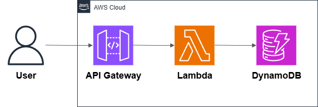
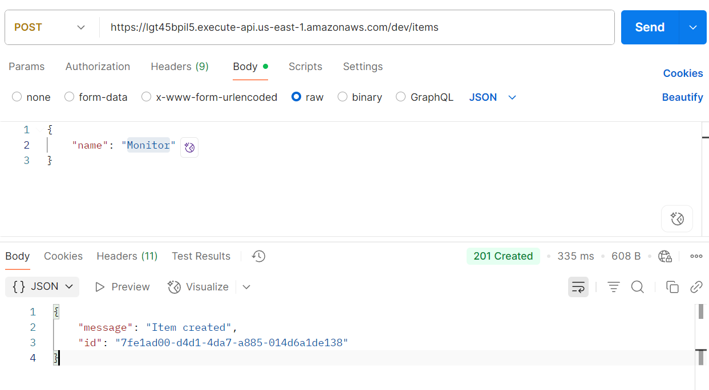
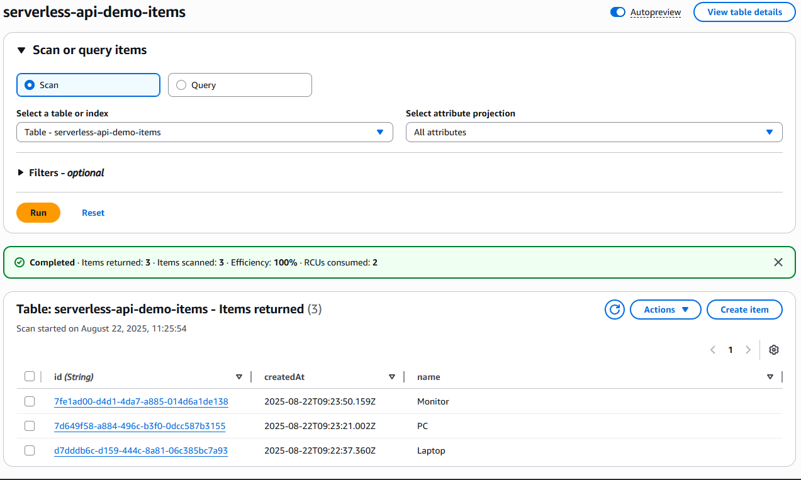
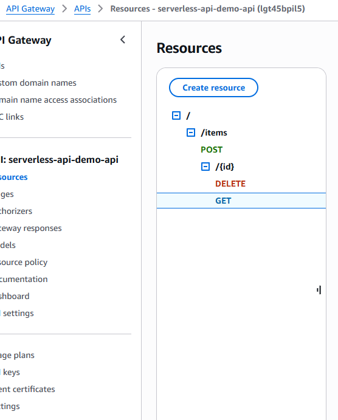

# AWS Serverless API Backend

## Project Summary

This repository implements a small AWS serverless backend for managing inventory or asset records. It exposes a REST-style API through API Gateway, runs TypeScript Lambda handlers, stores records in DynamoDB, and provisions the cloud infrastructure with Terraform.

The project is designed as a cloud/backend engineering portfolio project: realistic enough to discuss architecture, validation, IAM, observability, CI, and trade-offs, while still intentionally scoped as a learning and demonstration system rather than a production-ready service.

## Real-World Use Case

The API can be viewed as the backend for a simple internal inventory or asset registry. A team could use this pattern to create, look up, and remove item records without operating servers, containers, or a relational database.

Example scenarios:

- Tracking lightweight internal assets by ID
- Supporting a small admin tool or internal dashboard
- Prototyping a serverless item-management workflow
- Demonstrating a DynamoDB key-value access pattern behind an HTTP API

## Architecture Diagram



## Architecture Overview

```text
Client
  -> API Gateway REST API
  -> Lambda handler
  -> DynamoDB table
  -> Lambda handler
  -> API Gateway response
  -> Client
```

| Component | Role in this project |
| --- | --- |
| API Gateway | Public HTTP entry point for `POST /items`, `GET /items/{id}`, and `DELETE /items/{id}` |
| AWS Lambda | Runs separate TypeScript handlers for create, read, and delete operations |
| DynamoDB | Stores item records using `id` as the partition key |
| IAM | Allows API Gateway to invoke Lambda and scopes Lambda data access to the project DynamoDB table |
| CloudWatch Logs | Receives structured Lambda logs and API Gateway access logs with configurable retention |
| CloudWatch Alarms | Provides basic alarms for Lambda errors, Lambda throttles, and API Gateway 5XX responses |
| Terraform | Defines the DynamoDB table, IAM role and policy, Lambda functions, API Gateway resources, deployment stage, operational settings, and output URL |
| GitHub Actions CI | Runs Lambda checks, packages deployment artifacts, and validates Terraform formatting/configuration |

## API Endpoints

The API is deployed to the `dev` API Gateway stage.

| Method | Route | Purpose | Success response |
| --- | --- | --- | --- |
| `POST` | `/items` | Create an item with a generated UUID and timestamp | `201 Created` |
| `GET` | `/items/{id}` | Fetch an item by UUID | `200 OK` |
| `DELETE` | `/items/{id}` | Delete an item by UUID | `200 OK` |

### Validation Behavior

Request validation is implemented in the Lambda application layer with Zod.

For `POST /items`:

- Request body must be valid JSON.
- `name` is required.
- `name` must be a string.
- `name` is trimmed before storage.
- Empty or whitespace-only names are rejected.
- `name` must be 100 characters or fewer.

For `GET /items/{id}` and `DELETE /items/{id}`:

- `id` is required.
- `id` must be a valid UUID.

Invalid requests return `400` JSON error responses. Missing items return `404`.

## Example Requests

Replace `<API_URL>` with the Terraform output value:

```bash
terraform output api_url
```

Create an item:

```bash
curl -X POST "<API_URL>/items" \
  -H "Content-Type: application/json" \
  -d '{"name":"Laptop charger"}'
```

Example response:

```json
{
  "message": "Item created",
  "id": "00000000-0000-4000-8000-000000000001"
}
```

Get an item:

```bash
curl -X GET "<API_URL>/items/<ITEM_ID>"
```

Delete an item:

```bash
curl -X DELETE "<API_URL>/items/<ITEM_ID>"
```

## Engineering Quality Signals

This project includes several backend engineering practices beyond the minimum required to make a tutorial API work:

- TypeScript strict mode for Lambda handlers and shared utilities
- Shared utility modules for HTTP responses, environment variable handling, JSON parsing, logging, and validation
- Zod request validation for request bodies and path parameters
- Unit tests with Vitest for success paths, validation failures, not-found responses, and DynamoDB error handling
- GitHub Actions CI for install, typecheck, tests, build, production dependency audit, Lambda packaging, Terraform formatting, and Terraform validation
- `npm audit --omit=dev` included in CI for production dependency vulnerability checks
- Structured JSON logging from Lambda handlers
- API Gateway access logging, CloudWatch method metrics, and basic throttling configured with Terraform
- CloudWatch alarms for common API and Lambda failure signals
- Terraform-managed AWS infrastructure instead of manual console setup
- Lambda deployment packages generated by `scripts/package-lambdas.sh`

## Security Considerations

This project intentionally keeps API security simple so the core serverless architecture is easy to inspect.

Current state:

- API Gateway methods currently use `authorization = "NONE"`.
- The deployed API is publicly reachable unless additional controls are added.
- API Gateway throttling is configured to reduce accidental abuse and cost risk, but it is not a substitute for authentication or WAF protections.
- Lambda permissions allow API Gateway to invoke the functions.
- Lambda DynamoDB permissions are scoped to the project table and limited to `PutItem`, `GetItem`, and `DeleteItem`.
- No secrets should be committed to the repository, Terraform files, Lambda source, or local configuration.

Before treating this as a production pattern, the API should add an authentication and authorization layer such as Amazon Cognito, a JWT authorizer, IAM authorization, or another identity-aware gateway pattern. Public APIs should also add abuse protection appropriate to the use case.

## Observability

The Lambda handlers emit structured JSON logs to CloudWatch Logs. These logs are designed to be readable by humans and queryable by log tooling.

Logged fields include:

- Timestamp
- Log level
- Service name
- AWS request ID when Lambda context is available
- Route
- Operation name
- HTTP status code for completed outcomes
- Safe item ID values for item-level operations
- Error name and error message for unexpected failures

The handlers do not log full request bodies. That keeps potentially sensitive user-submitted data, such as item names, out of application logs.

API Gateway access logs are also enabled for the `dev` stage. They include request metadata such as request ID, source IP, HTTP method, resource path, status, response length, and integration error message when API Gateway provides one. They intentionally do not include request bodies, authorization headers, sensitive headers, or environment variables.

The API Gateway stage enables CloudWatch method metrics and uses basic throttling defaults of 20 requests per second with a burst limit of 40 requests. These values are intentionally modest for a demo project and can be adjusted with Terraform variables.

CloudWatch alarms are created by default for Lambda errors, Lambda throttles, and API Gateway 5XX responses. The alarms do not require SNS setup; provide `alarm_actions` if notification actions should be attached.

Current observability gaps:

- No distributed tracing yet
- No dashboard yet
- No 4XX or latency alarms yet
- No alarm notification destination unless `alarm_actions` is configured

## Cost Awareness

The architecture uses a low-operational-overhead serverless model:

- API Gateway charges mainly by request volume.
- Lambda charges by invocation count and duration.
- DynamoDB is configured with on-demand billing.
- CloudWatch Logs can still create cost through ingestion and retention.
- API Gateway access logs add a small CloudWatch Logs ingestion and storage cost.
- CloudWatch alarms add a small monthly monitoring cost while enabled.
- API Gateway throttling helps reduce accidental request spikes and abuse-related cost risk.

Terraform configures Lambda and API Gateway access log groups with 7-day retention by default to reduce long-lived log storage cost. After demos or testing, run `terraform destroy` to avoid leaving AWS resources active.

## Deployment

Prerequisites:

- AWS account and credentials configured locally
- Terraform `>= 1.5.0`
- Node.js and npm
- Bash-compatible shell
- `zip` available on `PATH`

Install and validate Lambda code:

```bash
cd lambdas
npm ci
npm run typecheck
npm test
npm run build
npm audit --omit=dev
cd ..
```

Package Lambda functions from the repository root:

```bash
bash scripts/package-lambdas.sh
```

The packaging script installs dependencies, compiles the TypeScript handlers, installs production dependencies for the packages, and creates the Lambda zip files expected by Terraform:

- `lambdas/createItem.zip`
- `lambdas/getItem.zip`
- `lambdas/deleteItem.zip`

Validate Terraform:

```bash
cd terraform
terraform fmt -check -recursive
terraform init -backend=false
terraform validate
```

Deploy:

```bash
terraform apply
terraform output api_url
```

Use the `api_url` output as `<API_URL>` in the example requests.

## CI Validation

GitHub Actions runs two jobs:

- Lambda checks: `npm ci`, `npm run typecheck`, `npm test`, `npm run build`, `npm audit --omit=dev`, and Lambda packaging
- Terraform checks: artifact download, `terraform fmt -check -recursive`, `terraform init -backend=false`, and `terraform validate`

The CI workflow validates the application and infrastructure definitions, but it does not currently deploy to AWS.

## Repository Structure

| Path | Purpose |
| --- | --- |
| `lambdas/createItem.ts` | Lambda handler for `POST /items` |
| `lambdas/getItem.ts` | Lambda handler for `GET /items/{id}` |
| `lambdas/deleteItem.ts` | Lambda handler for `DELETE /items/{id}` |
| `lambdas/src/utils/` | Shared Lambda utilities |
| `lambdas/src/validation/` | Zod request validation |
| `lambdas/__tests__/` | Vitest unit tests |
| `scripts/package-lambdas.sh` | Build and packaging script for Lambda zip artifacts |
| `terraform/` | Terraform configuration for AWS resources |
| `.github/workflows/ci.yml` | GitHub Actions CI workflow |
| `diagram/` | Architecture diagram source and rendered image |
| `images/` | Demo screenshots |

## Demo Screenshots

These screenshots show the deployed API being exercised and the backend resources/results visible during testing.





## Limitations

This project is not production-ready yet. The main limitations are:

- No authentication or authorization yet
- Basic API Gateway throttling is configured, but there is no per-client usage plan or API key strategy
- Basic API Gateway access logs are configured, but there is no dashboard or log analytics layer yet
- Basic CloudWatch alarms are configured, but notifications require optional `alarm_actions`
- No separate `dev`, `staging`, and `prod` environments
- No Terraform remote state backend
- No automated smoke tests against a deployed API
- No CI/CD deployment pipeline
- Single-table DynamoDB design is intentionally simple and only supports lookup by `id`

## Architecture Trade-Offs

Why serverless for this project:

- Lower operational overhead than managing EC2 instances or containers
- Natural fit for low-to-moderate traffic APIs and internal tools
- Usage-based cost model for small workloads
- Clear separation between HTTP routing, compute, and persistence

Trade-offs:

- Cold starts and Lambda limits need to be considered for latency-sensitive workloads.
- API Gateway and Lambda behavior can be less transparent than a traditional long-running service.
- DynamoDB requires access-pattern-first data modeling and is not a drop-in replacement for relational querying.
- Production systems need additional work around auth, throttling, monitoring, deployment safety, and environment separation.

## Architecture Decisions

Lightweight ADRs capture the main design choices and trade-offs behind this project:

- [001. Use API Gateway, Lambda, and DynamoDB for the serverless item API](docs/adr/001-use-serverless-api-gateway-lambda-dynamodb.md)
- [002. Use DynamoDB for Item Storage](docs/adr/002-use-dynamodb-for-item-storage.md)
- [003. Add Validation, Structured Logs, and Basic Operability Controls](docs/adr/003-operability-validation-and-observability.md)

## Interview Talking Points

This project demonstrates:

- Serverless API design using API Gateway, Lambda, and DynamoDB
- Terraform infrastructure as code for a small but complete AWS backend
- DynamoDB key-value access using `id` as the primary lookup pattern
- Input validation with Zod before calling DynamoDB
- CI quality gates for TypeScript, tests, builds, dependency audit, packaging, and Terraform validation
- Structured JSON logging for operational debugging
- Least-privilege thinking for Lambda access to DynamoDB
- Clear production trade-offs rather than overstating readiness

Good discussion prompts:

- How would authentication be added with Cognito or JWT authorizers?
- Where should throttling, access logs, and alarms be configured?
- When would DynamoDB be a good fit, and when would RDS be better?
- How would the Terraform be split for multiple environments?
- What smoke tests would be valuable after deployment?
- How would CI evolve into safe deployment automation?

## Future Improvements

Priority improvements:

- Add Cognito, JWT authorizer, IAM auth, or another authorization layer
- Add API Gateway usage plans, API keys, or WAF if the API needs stronger public abuse controls
- Add CloudWatch dashboards and additional alarms for API Gateway 4XX rates, latency, and DynamoDB throttling
- Introduce environment separation for `dev`, `staging`, and `prod`
- Add Terraform remote state and locking
- Expand ADR coverage for future design changes
- Add smoke tests that run against a deployed API URL
- Add a controlled deployment workflow after validation passes

## Cleanup

To remove deployed AWS resources:

```bash
cd terraform
terraform destroy
```

Review the destroy plan before confirming. After cleanup, check for any retained resources or CloudWatch log groups that may need manual review.

## Portfolio Context

This repository is part of an AWS architecture portfolio and focuses specifically on the serverless API backend pattern.

Portfolio hub:

[AWS Architecture Portfolio](https://github.com/hongzz0618/aws-architecture-portfolio)
