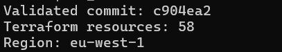
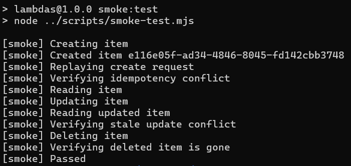
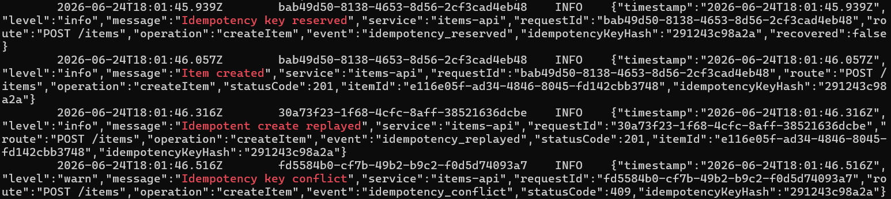
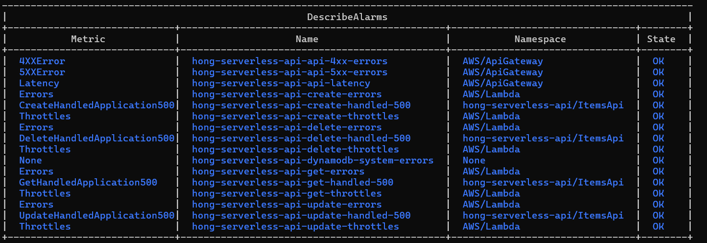
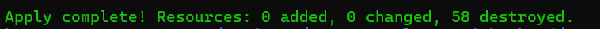

# AWS Deployment Validation

## Validation summary

A complete real AWS deployment-validation-destroy cycle was executed for this serverless API in `eu-west-1`. The cycle followed the engineering loop:

`Deploy → Observe → Diagnose → Correct → Add regression coverage → Redeploy → Verify → Destroy`

The deployment completed successfully, the runtime smoke test passed after a discovered IAM defect was corrected, observability signals were reviewed, and the environment was destroyed after validation. This record describes a completed validation cycle; the API is no longer deployed or publicly available.

## Scope and environment

The validation covered the Terraform-managed API Gateway, Lambda, DynamoDB, IAM, CloudWatch Logs, metric filters, and CloudWatch alarm resources for the project. Terraform managed `58` resources during the deployment in AWS region `eu-west-1`.

The cycle validated both infrastructure behavior and runtime API behavior. Automated tests and Terraform plan-contract tests remained part of the project quality checks, while this document records the separate real AWS runtime validation.

Runtime behavior was validated at commit `c904ea2`. Subsequent commits were limited to destroy cleanup, regression-test alignment, Terraform and CI version alignment, package metadata, and documentation; the validated Lambda runtime behavior did not change.

### Scope note for async features

This evidence predates the asynchronous Stream -> Dispatcher -> SQS -> Worker -> DLQ flow. It validates the synchronous CRUD API, idempotency behavior, optimistic locking, and original observability resources only.

The screenshots and deployment record must not be interpreted as proof that the new async chain has been validated in AWS. The async path will be validated separately during the next real AWS deployment. The historical evidence is retained as-is, and no new deployment result is claimed here.

## Runtime scenarios verified

The runtime smoke test verified the main API behavior against the deployed AWS environment:

- Item creation
- Idempotent request replay
- Idempotency-key conflict
- Item retrieval
- Optimistic-locking update
- Stale-version conflict
- Item deletion
- Post-deletion `404`

The DynamoDB items table was verified to be empty after the smoke test completed.

## Observability verification

API Gateway access logs showed the expected `201`, `200`, `409`, and `404` responses for the smoke-test flow.

Lambda structured logs showed the expected idempotency and create-path events:

- `Idempotency key reserved`
- `Item created`
- `Idempotent create replayed`
- `Idempotency key conflict`

CloudWatch alarms were created and verified as part of the deployed infrastructure.

## Defect discovered and correction

The initial runtime deployment exposed a real IAM defect in the Lambda DynamoDB permissions. The create flow uses a DynamoDB transaction, but DynamoDB transaction authorization requires the underlying item permissions used by each transaction statement.

The IAM policy was corrected to authorize the required underlying item operations, including `PutItem` and `UpdateItem`, instead of relying on `dynamodb:TransactWriteItems`. Regression coverage was added for the corrected table-specific action sets. After the infrastructure was updated, the complete smoke test passed.

## Cleanup and reproducibility

Terraform destroy completed successfully. All `58` Terraform-managed resources were destroyed, and the Terraform state resource count was verified as zero.

The API Gateway regional CloudWatch role configuration was reset during cleanup. A post-destroy Terraform plan showed that the environment remained reproducible and could create `58` resources again. GitHub CI was green at the end of the validation cycle.

## Evidence

The deployment summary records the validated commit, AWS region, and the `58` Terraform-managed resources present during runtime validation.

The smoke-test evidence shows the runtime API checks passing after the IAM correction and redeployment.

The structured log evidence shows Lambda application events for idempotency reservation, item creation, replay, and conflict handling.

The CloudWatch evidence shows that the expected alarms were created and reviewed during validation.

The destroy evidence records the successful removal of all `58` Terraform-managed resources. State cleanup and post-destroy reproducibility were verified separately after teardown.

